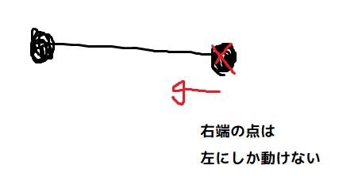
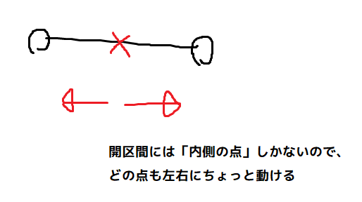

# $\mathbb{R}$の開集合と閉集合

位相空間を定義する前に、様々な例を知っておくとよいだろう。

私たちが数学で「図形」と思うようなものの多くは、位相空間としても扱うことができる。このページではその第一歩として、数直線、すなわち実数全体の集合 $\mathbb{R}$ における開集合と閉集合を紹介する。

## 開区間と閉区間

開区間と閉区間の定義を確認しておこう。以下、$a, b$ は実数とし、$a < b$ を満たすとする。

- **開区間** $(a,b)$ は、$a < x < b$ をみたす実数 $x$ の集合である。すなわち、
  $$ (a, b) := \\{x \in \mathbb{R}: a < x < b\\} $$
- **閉区間** $[a,b]$ は、$a \leq x \leq b$ をみたす実数 $x$ の集合である。すなわち、
  $$ [a, b] := \\{x \in \mathbb{R}: a \leq x \leq b\\} $$

「端っこの点」を要素として持つかどうかが開区間と閉区間の違いである。たった2点の差であるが、数学的な性質は大きく異なる。どう違うかは、今後折に触れて紹介することになると思う。

!!! remark "注意"
    開区間の記号 $(a,b)$ は、座標平面上の点を表す記号 $(x,y)$ と全く同じである(たぶん)。こういう記号のバッティングは数学ではよく発生するので、空気を読んで使い分ける必要がある。

区間に関連して、いくつか追加で定義しておく。

- 以下の2つの集合を**半開区間**という。
    - $(a, b]:= \{x \in \mathbb{R}: a < x \leq b\}$
    - $[a, b):= \{x \in \mathbb{R}: a \leq x < b\}$
- 区間の端として$\pm \infty$を許すこともある。具体的には、
    - $(-\infty, a) := \{x \in \mathbb{R} : x < a \}$
    - $(-\infty, a] := \{x \in \mathbb{R} : x \leq a \}$
    - $(a, \infty) := \{x \in \mathbb{R} : a < x\}$
    - $[a, \infty) := \{x \in \mathbb{R} : a \leq x \}$
- 同様に、$(-\infty, +\infty)$ となる。

## $\mathbb{R}$ の開集合

開集合の定義は、開区間の「端っこの点が入ってない感じ」を定式化したものになっている。そこで、まず、「端っこの点っぽさ」をもう少し掘り下げてみよう。

閉区間の端っこの点は、「そこより先に動くことができない」という特徴を持つ。それ以外の点は左右にある程度動くことができるが、端っこの点だけは動くことができない方向がある。

一方、開区間は「端っこの点」を持たない。すなわち、どの点もちょっとだけなら左右に動くことができる。

この性質を定式化したものが、以下の定義である：

!!! definition "定義"
    $\mathbb{R}$ の部分集合 $U$ が**開集合**であるとは、任意の $p \in U$ に対して、
    ある $\epsilon>0$ が存在して、
    $$ I_\epsilon (p) := (p-\epsilon, p+\epsilon) \subset U $$
    が成り立つことをいう。

このような「任意の-ある」式の命題は、位相空間論以外にもあらゆる分野で頻出するのだが、その扱いはなかなか難しい（詳しくは論理のページで書こうと思っています）。

定義において、「$p$ を中心として、左右に $\epsilon$ だけ広がっている開区間」$(p-\epsilon, p+\epsilon)$ に $I_\epsilon (p)$ という名前を付けている。これはかえって面倒くさいかもしれないが、より一般の場合を考えるための準備のつもりである。 

!!! example "例"
    具体的な $U$ として、開区間 $U = (a,b)$ (ただし、$a, b$ は $a < b$ を満たす実数)が開集合の定義を満たすことを示そう。

    $p \in (a,b)$ を取る。このとき、

    - $a < p \leq (a+b)/2$ であれば、
    $$ I_{p-a} (p) = (p-(p-a), p+(p-a)) = (a, 2p-a) \subset (a,b) $$
    が成り立つ。すなわち、$p$ から左右に $p-a$ だけ動くことができる。
    - $(a+b)/2 \leq p < b$ であれば、
    $$ I_{b-p} (p) = (p - (b-p), p+(b-p)) = (2p-b, b) \subset (a,b) $$ 
    が成り立つ。すなわち、$p$から左右に $b-p$ だけ動くことができる。
    
    以上により、すべての点 $p \in (a,b)$ について、ある $\epsilon > 0$ が存在して、$I_\epsilon(p) \subset (a,b)$ が成り立つことがわかった。したがって、$(a,b)$ は開集合である。

開集合の性質として、「開集合たちの合併集合も開集合」というものがある。これは非常に重要な性質である：

!!! proposition "命題"
    $\{U_i\}_{i \in I}$ を $\mathbb{R}$ の開集合の[族](../glossary.md)とする。このとき、それらの合併集合 $\bigcup_{i \in I} U_i$ も開集合である。

**証明** 
$p \in \bigcup_{i \in I} U_i$ を取る。合併集合の定義から、ある $i \in I$ について、$p \in U_i$ が成り立つ。$U_i$ は $\mathbb{R}$ の開集合だから、ある$\epsilon>0$ が存在して、
$$ I_\epsilon(p) \subset U_i $$
が成り立つ。したがって、$I_\epsilon(p) \subset \bigcup_{i \in I} U_i$ である。 $\square$

さっそく使ってみよう。

!!! example "例"
    「整数でない実数の集合」$\mathbb{R} \setminus \mathbb{Z}$ は、
    $$ \mathbb{R} \setminus \mathbb{Z} = \bigcup_{n \in \mathbb{Z}} (n, n+1) $$
    という形で、無限個の開区間の合併集合として書くことができる。それぞれの開区間 $(n, n+1)$ は開集合だったから、その合併である $\mathbb{R} \setminus \mathbb{Z}$ も開集合である。